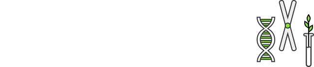

# Bioicons

Bioicons is a free library of open source icons for scientific illustrations using vector graphics software such as [Inkscape](https://inkscape.org) or Adobe Illustrator. 

The website supports two modes: 
- Copy to clipboard (only in Webkit browser such as Google Chrome, Brave or Microsoft Edge), this will copy an image file and a text representation of the svg file in the clipboard. In Inkscape the image will be pasted (in future versions of Inkscape the svg will be used), in Adobe Illustrator the svg will be pasted and can directly be edited. 

- Download on click: Simply click on the icon and the vector in svg format will be downloaded. You can use this on the web, in graphics software and in Microsoft Office products. Note that vector images can be scaled infinitely. 

Note that in vector graphics software you double click on the icons and edit them or delete parts that you do not want. Note that if the icon is licensed as CC BY you still need attribute and state the modifications made. 

## Coming soon: Inkscape symbol library

Inkscape supports symbol libraries and I plan to provide an automatic script that converts the icon library in files organized by category/license such that they can directly be used in Inkscape. 

## Contribute

If you want to make available icons (preferably under `CC-0` or `MIT` License) to the community via this platform you can either open a new issue and link the icon or create a pull request as described in [CONTRIBUTING](Contributing).
