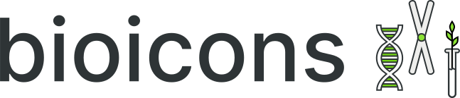

# Bioicons

Bioicons is a free library of open source icons for scientific illustrations using vector graphics software such as [Inkscape](https://inkscape.org) or Adobe Illustrator. 

The website supports two modes: 
- Copy to clipboard (only in Webkit browser such as Google Chrome, Brave or Microsoft Edge), this will copy an image file and a text representation of the svg file in the clipboard. In Inkscape the image will be pasted (in future versions of Inkscape the svg will be used), in Adobe Illustrator the svg will be pasted and can directly be edited. 

- Download on click: Simply click on the icon and the vector in svg format will be downloaded. You can use this on the web, in graphics software and in Microsoft Office products. Note that vector images can be scaled infinitely. 

Note that in vector graphics software you double click on the icons and edit them or delete parts that you do not want. Note that if the icon is licensed as CC BY you still need attribute and state the modifications made. 

## Contribute

If you want to make available icons (preferably under `CC-0` or `MIT` License) to the community via this platform you can either open a new issue and link the icon or create a pull request as described in [Contributing](CONTRIBUTING.md).

## Credits

Please always cite the individual icons and their respective license. Credit to the platform itself is appreciated but not necessary. 

### Example Citation
> bilharzie-egg icon by Servier https://smart.servier.com/ is licensed under CC-BY 3.0 Unported https://creativecommons.org/licenses/by/3.0/, hepatitis-virus-interior icon by Servier https://smart.servier.com/ is licensed under CC-BY 3.0 Unported https://creativecommons.org/licenses/by/3.0/

Thanks to the  [Database Center for the life sciences/TogoTV](https://togotv.dbcls.jp/en/pics.html) and [Servier](https://smart.servier.com/) for making comprehensive open art libraries for the life sciences available. Their navigation is a bit clunky though and the formats are mixed images with vectors or in propietary format (Microsoft powerpoint emf). 
Bioicons is free and open and will accept any high quality science illustration as svg vector broadly fitting in the scope of the life sciences. 

If you are looking for other open clipart or Emojiis I recommend [OpenClipart](https://openclipart.org/) and [Openmojii](https://openmoji.org/)

The viewer website was inspired by the [heroicons.dev](https://heroicons.dev/) site built by [@zaydek](https://github.com/zaydek) under MIT License.
